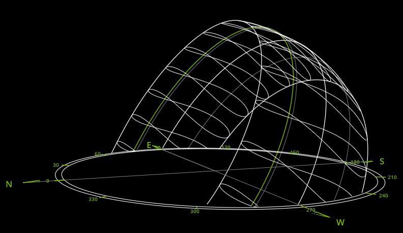

# Omniverse SunPath Extension

## Overview

SunPath is the diagram to show the path of the sun, sometimes also called day arc. Accurate location-specific knowledge of sun path is essential for some fields, such as architectural design and landscaping. This extension allows to add the SunPath diagram in the viewport window, and the diagram can be updated by setting it's parameters.

## User Interface

### 1. Display

> This group of widgets allows to control the display of SunPath diagram.

    
    
    

- **Show Path** : Switch on or off the checkbox to control whether the SunPath diagram is displayed or not.
- **Show Sun** : Switch on or off the checkbox to control whether the sunlight and the sphere(sun) is displayed or not.
- **Show Info** : Switch on or off the checkbox to control whether the information of sun direction, sunrise time, sunset time and datetime is displayed or not.
  

    
    
    

- **Path Color** : Select the color you prefer in the ColorWidget and click the update button to change the color of SunPath diagram.
- **Path scale** : Drag the slider or enter a value to change the size of SunPath diagram.
- **Gesture** : You can drag the block on the North tick-mark to move the SunPath diagram.

### 2. Location

> This group of widgets allows to set location parameters.

    
    

- **Longitude** : Allows to set Longitude, the "8" shape loop wire can be updated.
- **Latitude** : Allows to set Latitude, the Path rotation angle can be updated.

### 3. Datetime

> This group of widgets allows to set exact datetime parameters.

    
    
    

  - **Date**: Used to set the date of the year. Drag or enter datetime value will change this datetime's SunPath (the green curve).
  - **Hour**: Used to set the specific hour of the day. Drag or enter hour value can change the sun position of specific date, When the sun is below the horizon, the lights turn off.
  - **Minite**: Controlling the specific minute in a specific hour can finely control the position of the sun.

## SunPath Diagram Items

> The SunPath diagram is composed of Compass, Path, Sun and Shadow.

    
    
    

- **Compass**：The Compass provides the orientation reference of the scene, includes direcitons and angles.
- **Path**: The Path includes two kinds of Sun Path. First is the day arc of any datetime, SunPath diagram shows this arc of whole year. Second is the "8" shape loop wire, SunPath diagram shows same time Sun positon of whole year.
- **Sun**: Sun orientation will affected by the ocation and datetime. The sun of this Extension is simulated by the distant light. Therefore, some of its properties can be modified in the properties panel.
- **Shadow**: Shadows are generated by the distant light, Therefore, it is still can modified in its property panel.

## Usage

### 1. Install

* **Fork and clone this repo**: For example in  `D:\projects\kit-exts-sunpath`
* **Open extension manager**: Go to Menu -> Window -> Extension
* **Add SunPath extension**: Clik the button in the top left bar (gear button), add absolute extension path to Extension Search Paths.

### 2. Notice

- **Utlity**: To make this extension work correctly, you need to open the viewport utlity in the extensions manager first.
- **Pckage**: This extension relies on the python package(pyephem-SunPath) to generate key Sun data. Therefore, the first use will wait for a short time.
- **Coordinate system**: Coordinate system conversion has not been set in the current version of this extension, it was created based on XZ plane. You need to pay attention to whether the coordinate system of the imported USD is inconsistent.

