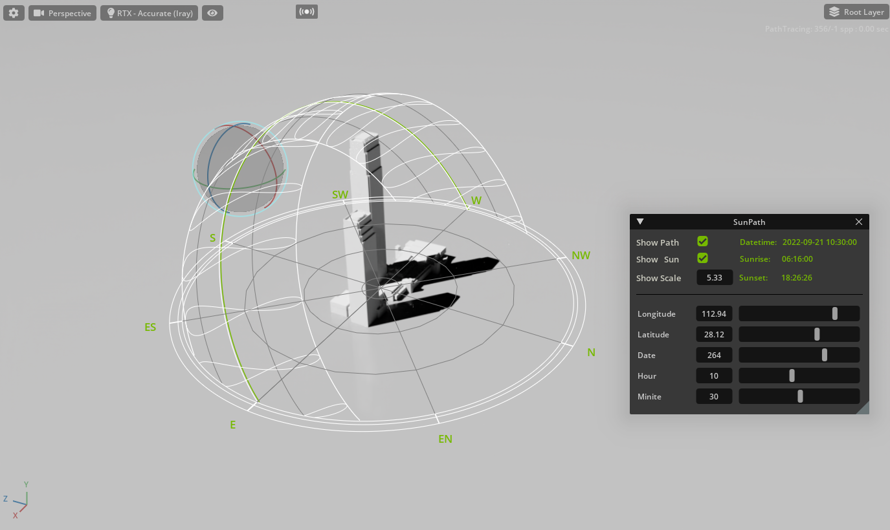
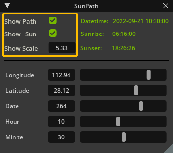
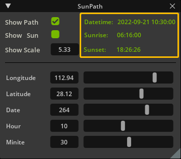
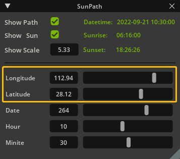
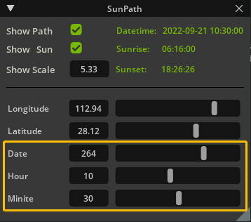
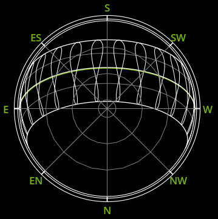
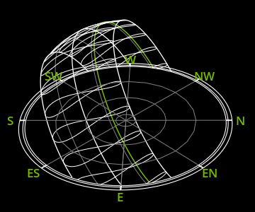
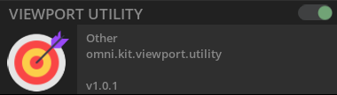

# SunPath (omniverse.secene.sunpath)

## Overview
        In architectural design, designers usually need to observe the changes of sunlight and shadows of buildings in different periods of time. In Omniverse, although there is already a very perfect environmental system that can adjust the sun, but in the early stage of the design, the architects do not need real lighting at the high level. The dynamic range of sunlight may be more useful to them.
        Therefore, This extension simulates an additional sun control system with the help of existing lights, and creates sunpath diagram.

### User Interface
* Visibility
  * 
  * Sunpath:
    * Click the show path checkbox to control whether the sunpath diagram is displayed or not.
  * Sunlight:
    * Click the show sun checkbox to control whether the sunlight is displayed or not.
  * Scale:
    * Drag the show scale box left and right to control the display size of the sunpath diagram.
* Information
  *  
  * Specific Datetime:
    * Real time display of specific time according to parameter modification.
  * Sunrise & Sunset:
    * Real time display of sunrise & sunset time according to parameter modification.
* Location
  * 
  * longitude: 
    * Used to locate buildings; Drag or enter longitude value will affect the sunpath on different dates (whole year) and at the same time ("8" shape curves).
  * latitude: 
    * Used to locate buildings;  Drag or enter latitude value will affect the orientation and rotation angle of the sunpath diagram.
* Datetime
  * 
  * Date: 
    * Used to set the date of the year. Drag or enter datetime value will change this datetime's sunpath (the green curve).
  * Hour: 
    * Used to set the specific hour of the day. Drag or enter hour value can change the sun position of specific date, When the sun is below the horizon, the lights turn off.
  * Minite: 
    * Controlling the specific minute in a specific hour can finely control the position of the sun.
### Sunpath diagram
* Compass：
  * 
  * The compass provides a coordinate reference for the scene. The compass of this extension provides eight orientations.
* Sunpath:
  *  
  * The sunpath diagram is composed of sunpath on the Spring Equinox, sunpath on the Summer Solstice, sunpath on the Midwinter Day, and sunpath on different dates (whole year) and at the same time ("8" shape curves). It also shows the sun path of specific time (green line).
### Sun & Shadow
* Sun: 
  * Sun position will affected by the location and datetime. The sun of this Extension is simulated by the distant light. Therefore, some of its properties can be modified in the properties panel of the distant light.
* Shadow: 
  * Shadows are generated by the distant light, Therefore, it is still can modified in its property panel.

## Usage
### Prepare
* Package:
  * This extension relies on the python package(pyephem-sunpath) to generate key sun data. Therefore, the first use will wait for a short time.
* Utlity:
  *  
  * To make this extension work correctly, you need to open the viewport utlity in the extension program first.
### Notice
* Coordinate system
  * Coordinate system conversion has not been set in the current version of this extension, it was created based on XZ plane. You need to pay attention to whether the coordinate system of the imported USD is inconsistent.

